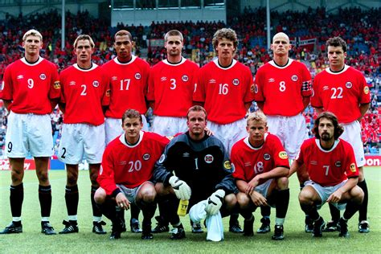

## Innledning



Denne rapporten viser resultatene fra VM-tuppekunkurransen.
Det fins script for å tolka excel-tabellen.


## Datagrunnlag
Her komme det sylskarpe analyser av svarene som e sendt inn

```{r dataprep}
library(readxl)
library(dplyr)
library(stringr)
library(ggplot2)
library(tidyverse)
library(tinytex)

# Les data
df <- read_excel(here::here("data/spmogsvar.xlsx"))

fasit <- df %>%
  filter(str_to_lower(Navn) == "fasit") %>%
  slice(1)


# Finn spørsmålskolonner
spm_cols <- setdiff(names(df), c("Id", "Navn"))

# Hent poengvekter fra kolonnenavn
weights <- tibble(
  kolonne = spm_cols,
  poeng = as.numeric(str_extract(spm_cols, "\\d+"))
)


# Filtrer bort fasit
deltakere <- df %>%
  filter(str_to_lower(Navn) != "fasit")

# Beregn poeng per spørsmål
poeng_df <- deltakere

# Total poengsum
poeng_df <- poeng_df %>%
  mutate(
    # Total = rowSums(select(., ends_with("_poeng")))
    Total = sample(10,n(),replace=T)
  )

# poeng_df


leaderboard <- poeng_df %>%
  select(Navn, Total) %>%
  arrange(desc(Total))

# leaderboard

```


## Poeng som allerede e delt ud


Her komme info om poeng som allerede e delt ud. Typisk itte innledande runder.

```{r leder}
ggplot(leaderboard, aes(x = reorder(Navn, Total), y = Total)) +
  geom_col(fill = "#2C7FB8") +
  coord_flip() +
  labs(
    title = "Rangering deltakere – VM-tipping",
    x = NULL,
    y = "Poeng"
  ) +
  geom_text(aes(label = Total), hjust = -0.2) +
  theme_minimal()


# 
# poeng_df %>%
#   select(Navn, ends_with("_poeng"))
  
```

## Poeng som gjenstår å spela om


Her komme info om kordan folk har svart på de spørsmålene som ennå ikkje e delt ud.


## Avansert analyse?
F.eks. ka resultat vil gi størst endring i resultattabellen?


