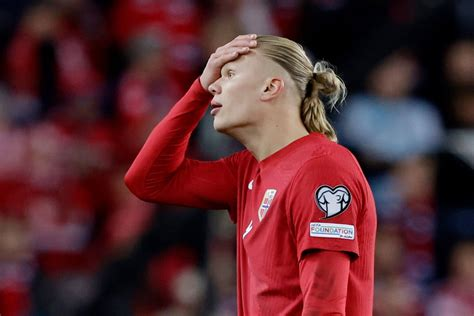

## Innledning 


Denne rapporten viser resultatene fra VM-tuppekunkurransen.
Utrolig avansert analyse er anvendt for å tolke innsendte tippelapper. 
Analysene tyter ut i figurer og tabeller i det følgende notatet. 
God lesning!


Notatet er oppdatert `r paste0(lubridate::mday(Sys.Date()),". ",c("Juni","Juli")[lubridate::month(Sys.Date())-5]," ",lubridate::year(Sys.Date()))`.


## Datagrunnlag


Her kommer det sylskarpe analyser av svarene som er sendt inn.
Analysene handler mest om å sette opp foreløpig stilling i tippekonkurransen,
holde motet oppe for de som ikke har fått så mange rett foreløpig og å la de som
har tippet ulikt få vite det. Den siste kan kanskje generere små bets foran TV-skjermen?

```{r dataprep}
library(ggplot2)
source(here::here("data/datavask.R"))
```

### Vanligste svar

```{r vanlig, include=FALSE}


alle_svar |> 
  filter(id!="Fasit",
         # spm %in% c("Q1","Q2","Q3")
         ) |> 
  left_join(alle_spm,
            by = join_by(spm)) |> 
  group_by(spm,tekst,svar) |> 
  summarise(Antall = n()) |> 
  summarise(std = sd(Antall)) |> 
  arrange(-std)


alle_svar |> 
  filter(id!="Fasit",
         spm %in% c("Q11","Q2","Q3")
         ) |> 
  left_join(alle_spm,
            by = join_by(spm)) |> 
  group_by(spm,tekst,svar) |> 
  summarise(Antall = n()) |> 
  ggplot(aes(x=tekst)) +
  geom_bar(aes(y=Antall,fill=svar), stat="identity")
```


### Irak-kampen

Irak er et land i Midtøsten som ligger mellom Iran i øst og Syria og Jordan i vest. Landet har en lang og rik historie som går helt tilbake til oldtiden, da området var kjent som Mesopotamia – ofte omtalt som «sivilisasjonens vugge» fordi noen av verdens første byer, skriftspråk og lover oppsto her. Skriftspråk og lover er to av sivilisasjonens fulltreffere,
men hvor mange fulltreffere får vi i kampen? 

```{r irak_maal}
alle_spm |> 
  filter(spm %in% c("Q9","Q10")) |> 
  left_join(alle_svar |> filter(id!="Fasit"),by = join_by(spm)) |> 
  left_join(metadata |>  select(id, autograf), by = join_by(id)) |> 
  # group_by(spm, tekst, svar) |> 
  # summarise(autograf = paste0(autograf,sep=", ")) |> 
  ggplot(aes(x=tekst)) +
  geom_label(aes(y=svar, label = autograf, col=svar),
             position = position_jitter(width = 0.2, height = 0.2)
             ) +
  xlab("") + ylab("") +
  theme_minimal() + theme(legend.position="none") +
  ggtitle(label = "Antall mål Irak-Norge", subtitle = "Saddam mod Jonas")
```


Hovedstaden i Irak er Bagdad, som også er landets største by. Irak har et variert landskap med store elver som Eufrat og Tigris, fruktbare sletter og ørkenområder. Disse elvene har vært avgjørende for jordbruk og bosetting gjennom tusenvis av år. Nå spør vi hvem som blir Norges første "innvandrer" på banen.


```{r irak_innbytter}
alle_spm |> 
  filter(spm %in% c("Q11")) |> 
  left_join(alle_svar |> filter(id!="Fasit"),by=join_by(spm)) |> 
  left_join(metadata |>  select(id, autograf)) |> 
  # group_by(spm, tekst, svar) |> 
  # summarise(autograf = paste0(autograf,sep=", ")) |> 
  ggplot(aes(x=tekst)) +
  geom_label(aes(y=svar, label = autograf, col=svar),
             position = position_jitter(width = 0.2, height = 0.2)
             ) +
  xlab("") + ylab("") +
  theme_minimal()+ theme(legend.position="none") +
  ggtitle("Fysste innbytter Irak-Norge")
```


Befolkningen i Irak består hovedsakelig av arabere og kurdere, og de fleste er muslimer, enten sunni eller sjia. Landet har de siste tiårene vært preget av konflikter og politisk uro, men det jobbes fortsatt med å bygge stabilitet og utvikling.
Den kurdiske delen av Irak ligger i nordøstre hjørnet. Hvor mange hjørnespark blir det i kampen? 


```{r irak_cornere}

alle_spm |> 
  filter(spm %in% c("Q12","Q13")) |> 
  left_join(alle_svar |> filter(id!="Fasit"),by=join_by(spm)) |> 
  left_join(metadata |>  select(id, autograf)) |> 
  # group_by(spm, tekst, svar) |> 
  # summarise(autograf = paste0(autograf,sep=", ")) |> 
  ggplot(aes(x=tekst)) +
  geom_label(aes(y=svar, label = autograf, col=svar),
             position = position_jitter(width = 0.2, height = 0.2)
             ) +
  xlab("") + ylab("") +
  theme_minimal() + theme(legend.position="none") +
  ggtitle("Antall cornere", subtitle = "Rima Iraki - Ræppa Norgi")
```

Til tross for utfordringene har Irak store naturressurser, spesielt olje, som er en viktig del av økonomien.
Og selv om vi kan være enige om at det er en næring som kommer til å være like viktig i fremtiden som i dag,
er det ikke sikkert vi er like enige om alt på banen. Vi spør hvor mange kort blir delt ut?
 

```{r irak_kort}

alle_spm |> 
  filter(spm %in% c("Q14","Q15")) |> 
  left_join(alle_svar |> filter(id!="Fasit"),by=join_by(spm)) |> 
  left_join(metadata |>  select(id, autograf)) |> 
  # group_by(spm, tekst, svar) |> 
  # summarise(autograf = paste0(autograf,sep=", ")) |> 
  ggplot(aes(x=tekst)) +
  geom_label(aes(y=svar, label = autograf, col=svar),
             position = position_jitter(width = 0.2, height = 0.2)
             ) +
  xlab("") + ylab("") +
  theme_minimal() + theme(legend.position="none") +
  ggtitle("Antall kort", subtitle = "")
```


<!-- Håper du har lært noe spennende om Norges motstander. Nå skal vi lære litt om  -->
<!-- hverandres motstand. Her er poenglistene: -->


<!-- ### Topp -->

<!-- Her komme det tabell med de så har mest poeng -->

<!--  -->


<!-- Edderkoppplott?? -->

<!-- ### Bunn -->

<!-- og minst poeng -->


<!--  -->

```{r leder}
# ggplot(leaderboard, aes(x = reorder(Navn, Total), y = Total)) +
#   geom_col(fill = "#2C7FB8") +
#   coord_flip() +
#   labs(
#     title = "Rangering deltakere – VM-tipping",
#     x = NULL,
#     y = "Poeng"
#   ) +
#   geom_text(aes(label = Total), hjust = -0.2) +
#   theme_minimal()


# 
# poeng_df %>%
#   select(Navn, ends_with("_poeng"))


```

<!-- ## Poeng som gjenstår å spela om -->

<!-- Her komme info om kor mange poeng folk har igjen å  få utdelt på spørsmålene som  -->
<!-- ennå ikkje e delt ud. -->


